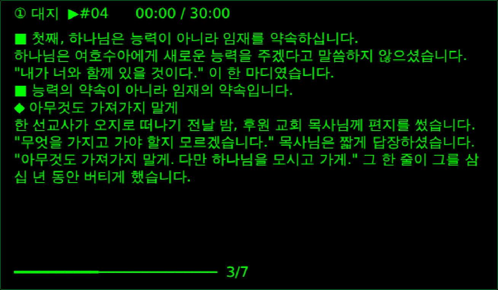

# 설교 HUD — MemoMind One 시제품

토탈 설교 앱의 **카드원고(`파일맵.cardArr`)를 변환 없이 그대로** 받아 MemoMind One 안경 화면(600×350)으로 나눠 띄우는 Web 플러그인입니다. **안경 없이** 공식 시뮬레이터에서 개발·점검할 수 있습니다.



- 머리말: `① 대지  ▶#04      12:34 / 30:00` — 지금 대지 · 이 화면이 시작되는 이미지 전환 컷 · 경과/목표 시간
- 본문: 카드 몇 줄. 대지 선언·강조 `■`, 예화 `◆`, 성구 `‹수 1:5›` + 전문
- 꼬리말: 진행 막대 + `3/6`

## 조작

| 안경 버튼 | 동작 |
|---|---|
| 한 번 | 다음 화면 |
| 두 번 | 이전 화면 |
| 길게 | 타이머 시작 · 멈춤 |

- 300 ms 안의 연타는 한 번으로 친다 — 설교 중 두 장씩 넘어가지 않게.
- **고개 돌려 넘기기는 기본 꺼짐.** 설교자는 말하면서 고개를 계속 움직이므로, 켜 두면 의도치 않게 넘어간다. 폰 조작판에서 켤 수 있다.

## 화면 나누는 규칙 (`src/deck-core.js` 의 `paginate`)

1. **이미지 전환(`trans`)마다 새 화면** — 회중 스크린과 안경 화면의 박자가 맞는다. 전환 바 글자 자체는 띄우지 않고 머리말에 `▶#07`(본문 컷은 `▶본문#05`)로 표시.
2. **대지 선언(첫째·둘째…)과 「말씀을 정리합니다」에서 새 화면** — 대지가 화면 중간에 묻히지 않게. 머리말 대지 번호도 여기서 올라간다.
3. 그 밖의 `head`(“그래서 우리는…” 같은 펀치라인)는 **앞 문단에 붙여** 흐른다 — 한 줄짜리 자투리 화면 방지.
4. 화면 용량(줄당 글자 × 화면당 줄)을 넘으면 다음 화면으로, 한 항목이 통째로 넘치면 문장 단위로 쪼갠다. **성구는 절 전문이 한 화면에 온전히** 들어가는지 테스트로 확인한다.

## 맥에서 시작하기

```sh
# 0) Node.js 확인 — 버전이 안 나오면 https://nodejs.org 에서 LTS 설치(또는 brew install node)
node -v

# 1) 공식 SDK 받기 (한 번만)
git clone https://github.com/memomind-open/plugin-open-platform ~/memomind-sdk
export MEMOMIND_SDK=~/memomind-sdk     # ⚠ 터미널을 새로 열 때마다 다시 입력

# 2) 이 프로젝트 폴더로 이동 → SDK 파일 복사 (SDK 는 MemoMind 약관 대상이라 프로젝트에 싣지 않는다)
#    압축본으로 받았다면 푼 폴더로:   cd ~/memomind-sermon-hud
#    설교앱 저장소 안이라면:          cd <저장소>/glasses/memomind-sermon-hud
npm run setup

# 3) 로직 테스트 (15개)
npm test

# 4) 시뮬레이터 실행 → 브라우저에서 http://127.0.0.1:4173
npm run studio
#    처음에 권한 승인 창이 뜨면 세 항목을 모두 체크하고 [按所选权限启动](선택한 권한으로 시작)

# 5) (선택) 자동 점검 — 다른 터미널에서. 버튼을 차례로 눌러 보고 화면을 screens-out/ 에 저장
npm install          # playwright 설치 (처음 한 번)
npx playwright install chromium
npm run simulate

# 6) 설치 파일 만들기 → sermon-hud-0.1.0.mmpkg
npm run pack
```

`~/memomind-sdk/Studio/macos/` 의 **Desktop Studio(.dmg)** 로도 열 수 있다. 실기기 설치용 QR 은 Desktop Studio 가 만든다(`PhoneSDK/docs/web-plugin/lan-install.md`).

## 설교앱 원고 넣기

폰 조작판 → **설교 불러오기** → 설교앱 `파일맵.cardArr` JSON 을 붙여 넣고 [불러오기].
`[{"t":"head","x":"…"}, …]` 배열 그대로, 또는 `{"title","ref","targetMin","cards":[…]}` 형태 모두 받는다.
불러온 설교·위치·보정값은 **호스트 저장소(`gm.storage`)** 에 남아 앱을 다시 열어도 보던 화면에서 이어진다.

> 다음 단계: 설교앱에 [👓 안경으로 보내기] 버튼을 두고, 이 플러그인이 시트에서 직접 받아 오게 한다. 그러려면 `manifest.json` 에 `network` 권한과 `index.html` CSP 의 `connect-src` 를 열어야 한다(지금은 둘 다 닫혀 있다).

## 안경 없이 확인한 것 · 확인할 수 없는 것

**시뮬레이터(Browser Studio)로 확인함** — 권한 선언이 호스트에 정확히 읽힘 · 버튼 3종과 고개 제스처 이벤트 처리 · 연타 방지 · 처음/끝에서 멈춤 · 타이머 · 보정값을 바꿔도 보던 카드 위치 유지 · 다시 시작 후 위치·보정값 복원 · 공식 패키저로 `.mmpkg` 생성(21 KB) · 콘솔 오류 0건.

**실기기에서만 알 수 있음**

1. **한글이 실제로 어떻게 보이는가.** 시뮬레이터는 글자를 **브라우저 글꼴(17 px system-ui)** 로 그린다 — 펌웨어 글꼴이 아니다. 그래서 시뮬레이터 화면의 한글은 안경에 한글이 있다는 증거가 **아니다.** 줄바꿈 위치도 실기기와 다를 수 있다.
   → 그래서 **[실기기 보정]** 칸을 넣었다. 안경을 받으면 화면 아래에 줄이 많이 남는지·글이 잘리는지 보고 `줄당 글자`·`화면당 줄`을 맞춘다(시뮬레이터 기준 37 × 11 이 맞았다. 기본값 30 × 12 는 일부러 보수적).
2. **글자 크기.** 기기 프로파일에는 큰 글씨(20 px)가 있지만, **Web 플러그인의 텍스트 채널에는 글자 크기 옵션이 없다.** 큰 글씨는 안경 쪽 GlassSDK 플러그인(C / RISC-V, `.gmp`)을 따로 만들어야 쓸 수 있다(공식 `novel_reader` 예제가 그 방식). 강단에서 글씨가 작으면 그게 다음 과제다.
3. **안경 버튼의 위치.** 설교 중 안경다리를 누르는 동작이 회중에게 보일 수 있다. MemoMind 의 반지형 컨트롤러(KiWear) 연동이 대안이며, Desktop Studio 는 보조 입력 장치를 흉내 낼 수 있다.
4. 블루투스 지연 · 밝기 · 강단 조명 아래 가독성 · 50분 연속 사용 배터리.

## 파일

| 경로 | 내용 |
|---|---|
| `src/deck-core.js` | 화면 나누기·머리말·입력 해석 — SDK 없는 순수 함수 |
| `src/plugin.js` | SDK 연결, 안경에 그리기, 저장·복원, 폰 조작판 |
| `src/sample-deck.js` | 샘플 설교(수 1:5-9). `npm run sample` 로 재생성 — 성구는 저장소 `bible/b06.json` 에서 읽는다 |
| `index.html` · `style.css` | 폰 조작판 |
| `manifest.json` | 플러그인 정보·권한(display, device.events, storage) |
| `test/` | 로직 테스트 15개 |
| `tools/setup.mjs` · `pack.mjs` · `simulate.mjs` | SDK 복사 · 패키징 · 시뮬레이터 자동 점검 |
